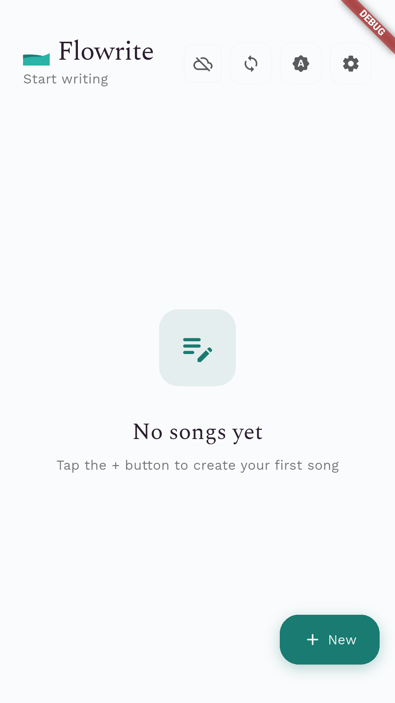

# 

write 📝


[](https://www.gnu.org/licenses/agpl-3.0)

[](https://github.com/pi22by7/flowrite/releases)
[](https://github.com/pi22by7/flowrite/actions/workflows/release.yml)

**Current Version: v2.0.0** | **Flutter: 3.32.6**

Flowrite is a modern, intuitive songwriting and poetry app designed to help creators capture their inspiration anywhere, anytime. With seamless cloud sync, a clean interface, and robust offline support, your creative process has never been more fluid.

But Flowrite is more than just another app—it's a statement about how creative tools should be built and shared.

## 💖 Why Open Source Matters for Creative Tools

When I started learning app development, it wasn't for the sake of coding itself—I wanted to build tools that could help my own creative process. The very first app I envisioned was a simple, beautiful space for songwriting and poetry. But as I searched for resources to learn from, I discovered something troubling: there were virtually no open-source songwriting apps to study, contribute to, or build upon.

This lack of accessible resources hampered my learning journey. I had to take detours, building other projects first to gain the skills I needed. But the dream of creating a truly accessible songwriting app never faded.

Now, with the experience I've gained, I've returned to that original vision. Flowrite embodies a core belief: **the process of creating art should never be paywalled, interrupted by ads, or locked behind proprietary walls.**

Imagine being in the middle of writing a song—that moment when the perfect line finally comes to you—only to be interrupted by a full-screen advertisement. Or discovering that the app you've been using to store your most personal creative work has been discontinued, taking your lyrics with it.

Creative tools should be:

- **Accessible to everyone**, regardless of economic status
- **Transparent** in how they handle your precious creative work
- **Sustainable** through community contribution rather than extractive business models
- **Educational** so the next generation of developers can learn and build upon them

This project is my contribution to that ideal—a foundation that others can learn from, improve upon, and adapt for their own creative needs.

## 📱 Screenshots

<div align="center">
  <table>
    <tr>
      <td align="center">
        
        <br>
        <em>Home Screen (Empty)</em>
      </td>
      <td align="center">
        
        <br>
        <em>Home Screen</em>
      </td>
      <td align="center">
        
        <br>
        <em>Editor Screen</em>
      </td>
    </tr>
    <tr>
      <td align="center">
        
        <br>
        <em>New File Dialog</em>
      </td>
      <td align="center">
        
        <br>
        <em>Settings Screen</em>
      </td>
      <td align="center">
        
        <br>
        <em>Dark Theme</em>
      </td>
    </tr>
  </table>
</div>

## ✨ Features

- 🎯 **Clean, Distraction-free Writing**: A minimalist interface that keeps you focused on your creativity, not the UI
- ☁️ **Seamless Cloud Sync**: Access your work across all devices with Supabase—your lyrics follow you everywhere
- 📱 **Reliable Offline Support**: Write anywhere, anytime. No internet? No problem. Your changes sync automatically when you're back online
- 💾 **Auto-save**: Never lose a brilliant line again with automatic saving as you type
- 🎨 **Material 3 Design**: Beautiful, modern UI with dynamic colors that adapt to your device's wallpaper (Android 12+)
- 🔤 **Premium Typography**: Choose from carefully selected fonts designed for long-form writing and creative work
- 📂 **Smart File Organization**: Sort, search, and organize your creative work with intuitive file management
- 🌙 **Dark Mode**: Easy on the eyes during those late-night creative sessions
- 🔐 **Secure Authentication**: Simple, secure Google Sign-in—no passwords to remember
- 🚫 **Zero Ads, Zero Paywalls**: Your creative process is sacred and should never be interrupted

## 📥 Download Flowrite

Ready to start writing? Pre-built releases are (or will be) available for multiple platforms:

- **Android**: APK and AAB files
- **Linux**: Portable tar.gz packages
- **Windows**: Portable zip packages
- **macOS**: Portable app bundles

[📥 **Download Latest Release**](https://github.com/pi22by7/flowrite/releases/latest)

## 🚀 Getting Started

### For Users

Simply [download the latest release](https://github.com/pi22by7/flowrite/releases/latest) for your platform and start writing! The app works great out of the box, and you can optionally sign in with Google to sync your work across devices.

### For Developers

Want to contribute, learn from the code, or build your own version? Here's how to get started:

#### Prerequisites

- Flutter SDK (latest stable version)
- A Supabase project set up (for cloud sync features)
- Google OAuth credentials configured in Supabase
- Environment variables configured (see setup below)
- An editor like Android Studio or VS Code

#### Setup

1. **Clone the repository**
   ```bash
   git clone https://github.com/pi22by7/flowrite.git
   cd flowrite
   ```

2. **Configure environment variables**
   ```bash
   cp .env.example .env
   # Edit .env with your Supabase credentials and Google OAuth client IDs
   ```

3. **Install dependencies**
   ```bash
   flutter pub get
   ```

4. **Run the app**
   ```bash
   flutter run
   ```

#### Installation & Development

1.  Clone the repository
    ```sh
    git clone https://github.com/pi22by7/flowrite.git
    ```
2.  Navigate to the project directory
    ```sh
    cd flowrite
    ```
3.  Install dependencies
    ```sh
    flutter pub get
    ```
4.  Run the app
    ```sh
    flutter run
    ```

## 🛠️ Development

This project includes robust scripts and workflows to streamline development, from generating screenshots to running tests.

### Generating Screenshots

This project includes automated screenshot generation for documentation and app store submissions.

#### Quick Start

```sh
# Generate screenshots automatically
./scripts/generate_screenshots.sh
```

#### Manual Process

1. **Ensure you have a device or emulator running:**

   ```sh
   flutter devices
   ```

2. **Get dependencies:**

   ```sh
   flutter pub get
   ```

3. **Run the integration test:**
   ```sh
   flutter test integration_test/app_test.dart
   ```

Screenshots will be saved in `assets/screenshots/` and organized by platform (android/ios).

📖 **For detailed screenshot generation documentation, see [docs/SCREENSHOTS.md](docs/SCREENSHOTS.md)**

#### Creating Placeholders

If you want to create placeholder screenshots for immediate use:

```sh
./scripts/create_placeholders.sh
```

#### Continuous Integration

Screenshots are automatically generated via GitHub Actions when:

- Code is pushed to main branch
- PRs are created that modify UI code
- Manually triggered via workflow dispatch

### Testing

#### Unit Tests

```sh
flutter test
```

#### Integration Tests

```sh
flutter test integration_test/
```

#### Widget Tests

```sh
flutter test test/
```

### Building for Release

We provide convenient build scripts for creating release builds:

#### Quick Build

```sh
# Build for Android
./scripts/build.sh android

# Build for Linux
./scripts/build.sh linux

# Build for all platforms (where supported)
./scripts/build.sh all
```

#### Creating a Release

```sh
# Bump version and create release tag
./scripts/release.sh 1.2.0

# Push to trigger automated release
git push origin main && git push origin v1.2.0
```

#### Manual Platform Builds

```sh
# Android
flutter build apk --release
flutter build appbundle --release

# Linux
flutter build linux --release

# Web
flutter build web --release
```

### Download Releases

Pre-built releases are available for multiple platforms:

- **Android**: APK and AAB files
- **Linux**: Portable tar.gz packages
- **Windows**: Portable zip packages
- **macOS**: Portable app bundles

[📥 Download Latest Release](https://github.com/pi22by7/flowrite/releases/latest)

## 🗺️ Roadmap

### ✅ Completed

- [x] Basic app structure and UI
- [x] Dark/Light theme support
- [x] Local file storage
- [x] Google Sign-in integration
- [x] Supabase integration
- [x] Auto-save functionality
- [x] File management (create, rename, delete)
- [x] Cloud sync capabilities
- [x] Reliable offline support and sync
- [x] Settings panel
- [x] Manual sync option
- [x] File conflict resolution
- [x] Material 3 UI with dynamic color
- [x] File sorting
- [x] CI/CD pipeline for automated builds and releases

### 🚧 In Progress / Planned

- [ ] Markdown support for rich formatting
- [ ] In-line text formatting (bold, italic, etc.)
- [ ] Comprehensive error handling and user feedback
- [ ] Performance optimizations and caching
- [ ] Comprehensive testing suite (Unit, Widget, Integration)
- [ ] Better error reporting (Crashlytics integration)
- [ ] Usage analytics to improve user experience
- [ ] Import/export functionality
- [ ] Collaborative writing features
- [ ] Plugin system for extensibility

_Want to work on any of these? Check out our [Contributing section](#-contributing)!_

## 🏗️ Built With

- [Flutter](https://flutter.dev/) - UI Framework
- [Supabase](https://supabase.com/) - Backend, Authentication & Database
- [Provider](https://pub.dev/packages/provider) - State Management
- [Google Sign In](https://pub.dev/packages/google_sign_in) - Authentication
- [dynamic_color](https://pub.dev/packages/dynamic_color) - Material 3 dynamic theming
- [shared_preferences](https://pub.dev/packages/shared_preferences) - Local storage
- [path_provider](https://pub.dev/packages/path_provider) - For finding commonly used locations on the filesystem.

## 🤝 Contributing

Contributions are what make the open source community such an amazing place to learn, inspire, and create. Any contributions you make are **greatly appreciated**.

**New to open source?** This project is designed to be beginner-friendly! We have a [TODO list](TODO.md) of features we'd like to add, ranging from simple UI improvements to more complex backend features.

**Experienced developer?** We'd love your help with performance optimizations, architectural improvements, or adding support for new platforms.

### How to Contribute

1.  Fork the Project
2.  Create your Feature Branch (`git checkout -b feature/AmazingFeature`)
3.  Commit your Changes (`git commit -m 'Add some AmazingFeature'`)
4.  Push to the Branch (`git push origin feature/AmazingFeature`)
5.  Open a Pull Request

### Resources for Contributors

- **[TODO](TODO.md)** - Features and improvements we'd love help with
- **[Contributing Guidelines](CONTRIBUTING.md)** - Detailed contribution guidelines
- **[Build & Release Guide](docs/BUILD_RELEASE_GUIDE.md)** - Comprehensive development setup
- **[Code of Conduct](CODE_OF_CONDUCT.md)** - Community guidelines

## 📚 Documentation

- **[Build & Release Guide](docs/BUILD_RELEASE_GUIDE.md)** - Comprehensive guide for building and releasing the app
- **[Contributing Guidelines](CONTRIBUTING.md)** - How to contribute to the project
- **[Code of Conduct](CODE_OF_CONDUCT.md)** - Community guidelines
- **[TODO](TODO.md)** - Planned features and improvements
- **[Changelog](CHANGELOG.md)** - Version history and changes

## 🔒 Privacy & Security

- All data is encrypted in transit.
- Google Sign-in for secure authentication.
- Local storage for offline access.
- Cloud sync is automatic and seamless.

## 📄 License

This project is licensed under the AGPL-3.0 License - see the [LICENSE](LICENSE) file for details.

## 📧 Contact

π - talk@pi22by7.me

Project Link: [https://github.com/pi22by7/flowrite](https://github.com/pi22by7/flowrite)

---

Made with ❤️ by π
