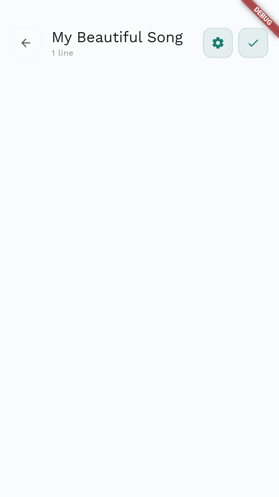
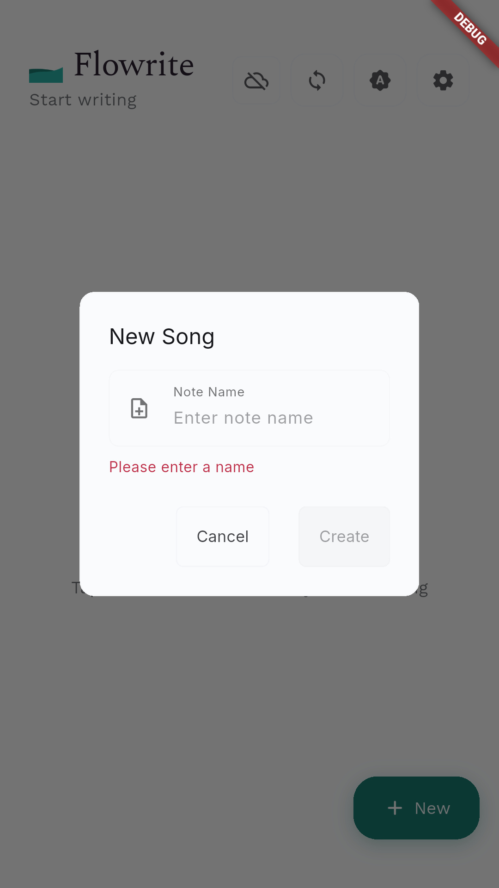
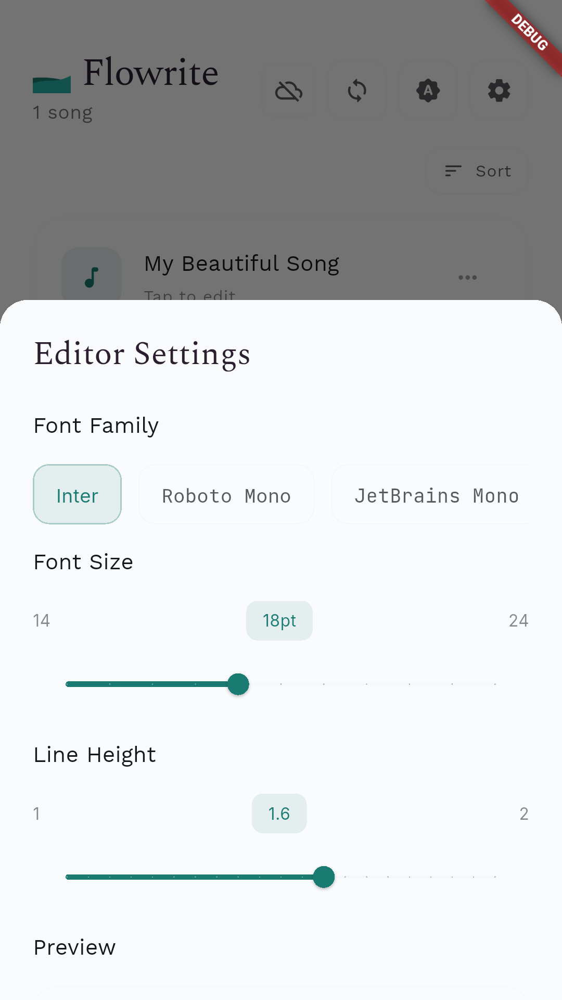

# Flowrite 📝


[](https://www.gnu.org/licenses/agpl-3.0)

[](https://github.com/pi22by7/flowrite/releases)
[](https://github.com/pi22by7/flowrite/actions/workflows/release.yml)

**Current Version: v2.0.0** | **Flutter: 3.32.6**

Flowrite is a modern, intuitive songwriting and poetry app designed to help creators capture their inspiration anywhere, anytime. With seamless cloud sync, a clean, minimalist interface, and robust offline support, your creative process has never been more fluid.

## 📱 Screenshots

<div align="center">
  <table>
    <tr>
      <td align="center">
        
        <br>
        <em>Home Screen (Empty)</em>
      </td>
      <td align="center">
        
        <br>
        <em>Home Screen</em>
      </td>
      <td align="center">
        
        <br>
        <em>Editor Screen</em>
      </td>
    </tr>
    <tr>
      <td align="center">
        
        <br>
        <em>New File Dialog</em>
      </td>
      <td align="center">
        
        <br>
        <em>Settings Screen</em>
      </td>
      <td align="center">
        
        <br>
        <em>Dark Theme</em>
      </td>
    </tr>
  </table>
</div>

## ✨ Features

- **Clean, Distraction-free Writing**: Focus on your creativity with our minimalist interface.
- **Cloud Sync**: Access your work across all your devices with Firebase Cloud Firestore.
- **Reliable Offline Support**: Write and edit anywhere, even without an internet connection. Your changes will sync automatically when you're back online.
- **Auto-save**: Never lose your work with automatic saving.
- **Material 3 Design**: A beautiful, modern UI with dynamic colors that adapt to your wallpaper (on supported Android devices).
- **Modern Typography**: Choose from a selection of beautiful, readable fonts to personalize your writing experience.
- **File Sorting**: Easily organize and find your files.
- **Dark Mode**: Easy on the eyes during late-night writing sessions.
- **Google Sign-in**: Secure and easy authentication.

## 🚀 Getting Started

To get a local copy up and running, follow these simple steps.

## 🛠️ Development

### Generating Screenshots

This project includes automated screenshot generation for documentation and app store submissions.

#### Quick Start

```sh
# Generate screenshots automatically
./scripts/generate_screenshots.sh
```

#### Manual Process

1. **Ensure you have a device or emulator running:**

   ```sh
   flutter devices
   ```

2. **Get dependencies:**

   ```sh
   flutter pub get
   ```

3. **Run the integration test:**
   ```sh
   flutter test integration_test/app_test.dart
   ```

Screenshots will be saved in `assets/screenshots/` and organized by platform (android/ios).

📖 **For detailed screenshot generation documentation, see [docs/SCREENSHOTS.md](docs/SCREENSHOTS.md)**

#### Creating Placeholders

If you want to create placeholder screenshots for immediate use:

```sh
./scripts/create_placeholders.sh
```

#### Continuous Integration

Screenshots are automatically generated via GitHub Actions when:

- Code is pushed to main branch
- PRs are created that modify UI code
- Manually triggered via workflow dispatch

### Testing

#### Unit Tests

```sh
flutter test
```

#### Integration Tests

```sh
flutter test integration_test/
```

#### Widget Tests

```sh
flutter test test/
```

### Prerequisites

- Flutter SDK (latest stable version)
- A Firebase project set up.
  - Android: `google-services.json`
  - iOS: `GoogleService-Info.plist`
- An editor like Android Studio or VS Code

### Installation & Development

1.  Clone the repository
    ```sh
    git clone https://github.com/pi22by7/flowrite.git
    ```
2.  Navigate to the project directory
    ```sh
    cd flowrite
    ```
3.  Install dependencies
    ```sh
    flutter pub get
    ```
4.  Run the app
    ```sh
    flutter run
    ```

### Building for Release

We provide convenient build scripts for creating release builds:

#### Quick Build

```sh
# Build for Android
./scripts/build.sh android

# Build for Linux
./scripts/build.sh linux

# Build for all platforms (where supported)
./scripts/build.sh all
```

#### Creating a Release

```sh
# Bump version and create release tag
./scripts/release.sh 1.2.0

# Push to trigger automated release
git push origin main && git push origin v1.2.0
```

#### Manual Platform Builds

```sh
# Android
flutter build apk --release
flutter build appbundle --release

# Linux
flutter build linux --release

# Web
flutter build web --release
```

### Download Releases

Pre-built releases are available for multiple platforms:

- **Android**: APK and AAB files
- **Linux**: Portable tar.gz packages
- **Windows**: Portable zip packages
- **macOS**: Portable app bundles

[📥 Download Latest Release](https://github.com/pi22by7/flowrite/releases/latest)

## 🏗️ Built With

- [Flutter](https://flutter.dev/) - UI Framework
- [Firebase](https://firebase.google.com/) - Backend, Authentication & Database (Cloud Firestore)
- [Provider](https://pub.dev/packages/provider) - State Management
- [Google Sign In](https://pub.dev/packages/google_sign_in) - Authentication
- [dynamic_color](https://pub.dev/packages/dynamic_color) - Material 3 dynamic theming
- [shared_preferences](https://pub.dev/packages/shared_preferences) - Local storage
- [path_provider](https://pub.dev/packages/path_provider) - For finding commonly used locations on the filesystem.

## 🔒 Privacy & Security

- All data is encrypted in transit.
- Google Sign-in for secure authentication.
- Local storage for offline access.
- Cloud sync is automatic and seamless.

## 🗺️ Roadmap

- [x] Basic app structure and UI
- [x] Dark/Light theme support
- [x] Local file storage
- [x] Google Sign-in integration
- [x] Firebase Cloud Firestore integration
- [x] Auto-save functionality
- [x] File management (create, rename, delete)
- [x] Cloud sync capabilities
- [x] Reliable offline support and sync
- [x] Settings panel
- [x] Manual sync option
- [x] File conflict resolution
- [x] Material 3 UI with dynamic color
- [x] File sorting
- [x] Implement CI/CD pipeline for automated builds and releases
- [ ] Markdown support
- [ ] In-line formatting
- [ ] Comprehensive error handling and user feedback
- [ ] Implement caching system for performance
- [ ] Add comprehensive testing (Unit, Widget, Integration)
- [ ] Improve error reporting (e.g., Crashlytics)
- [ ] Add analytics to understand user behavior

## 📚 Documentation

- **[Build & Release Guide](docs/BUILD_RELEASE_GUIDE.md)** - Comprehensive guide for building and releasing the app
- **[Contributing Guidelines](CONTRIBUTING.md)** - How to contribute to the project
- **[Code of Conduct](CODE_OF_CONDUCT.md)** - Community guidelines
- **[TODO](TODO.md)** - Planned features and improvements
- **[Changelog](CHANGELOG.md)** - Version history and changes

## 🤝 Contributing

Contributions are what make the open source community such an amazing place to learn, inspire, and create. Any contributions you make are **greatly appreciated**.

We have a [TODO list](TODO.md) of features we'd like to add. If you'd like to contribute, please check out our [contributing guidelines](CONTRIBUTING.md).

1.  Fork the Project
2.  Create your Feature Branch (`git checkout -b feature/AmazingFeature`)
3.  Commit your Changes (`git commit -m 'Add some AmazingFeature'`)
4.  Push to the Branch (`git push origin feature/AmazingFeature`)
5.  Open a Pull Request

For development and building instructions, see our [Build & Release Guide](docs/BUILD_RELEASE_GUIDE.md).

## 📄 License

This project is licensed under the AGPL-3.0 License - see the [LICENSE](LICENSE) file for details.

## 📧 Contact

π - talk@pi22by7.me

Project Link: [https://github.com/pi22by7/flowrite](https://github.com/pi22by7/flowrite)

---

Made with ❤️ by π
