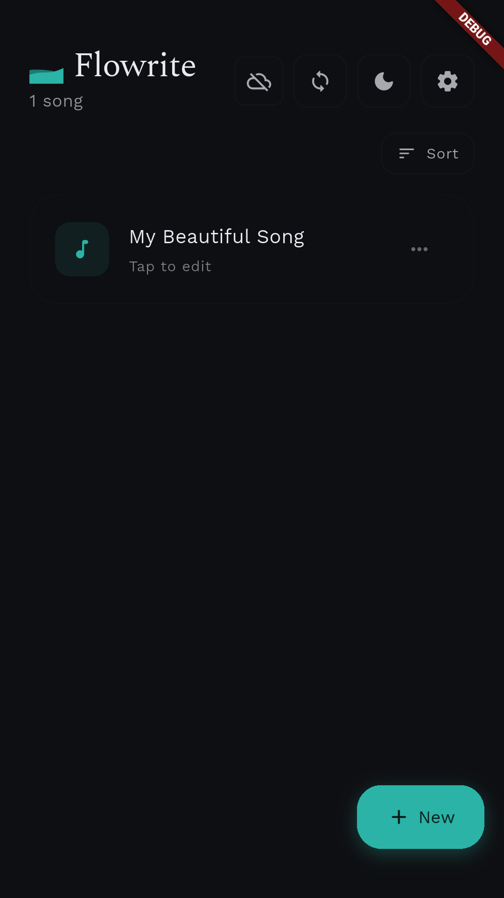

<div align="center">
  
</div>

# Flowrite 📝


[](https://www.gnu.org/licenses/agpl-3.0)

[](https://github.com/pi22by7/flowrite/releases)
[](https://github.com/pi22by7/flowrite/actions/workflows/release.yml)

**[🌐 Try Web Demo](https://flowrite.pi22by7.me)** | **[📥 Download](https://github.com/pi22by7/flowrite/releases/latest)** | **Current Version: v4.0.0** | **Flutter: 3.32.6**

A songwriter's sanctuary. Write lyrics anywhere, sync everywhere, lose nothing.

## 💖 Why This Exists

I started coding to build tools for my own creative work. My first vision was a simple space for songwriting, but I found almost nothing open source to learn from. That detour taught me what I needed to know, and now I'm back to that original dream.

**Flowrite is built on a simple belief: creating art should be free, uninterrupted, and yours.**

Picture this: you're mid-verse when the perfect line hits, then a full-screen ad breaks your flow. Or the app you trusted with your most personal work shuts down, taking everything with it.

Creative tools should be:

- **Accessible** to anyone, regardless of what they can pay
- **Transparent** about how they handle your work
- **Sustainable** through community, not extraction
- **Educational** for anyone who wants to learn

This is my contribution to that vision.

## 📱 Screenshots

<div align="center">
  <table>
    <tr>
      <td align="center">
        
        <br>
        <em>Home Screen (Empty)</em>
      </td>
      <td align="center">
        
        <br>
        <em>Home Screen</em>
      </td>
      <td align="center">
        
        <br>
        <em>Editor Screen</em>
      </td>
    </tr>
    <tr>
      <td align="center">
        
        <br>
        <em>Settings Screen</em>
      </td>
      <td align="center">
        
        <br>
        <em>Dark Theme</em>
      </td>
      <td align="center">
      </td>
    </tr>
  </table>
</div>

## ✨ What Makes It Different

**A Calm Space to Write**
Warm cream and charcoal palette. Time-aware greetings. Centered composition. Breathing button animation. Focus mode to hide everything but your words.

**Your Work, Always Safe**
Local-first architecture saves instantly. Sync happens quietly in background. Works offline, syncs when you're back. Smart retry with exponential backoff. Multi-device conflict resolution. Zero data loss, ever.

**Songwriter's Tools**
Visual syllable patterns (dots, triangles, hexagons) that adapt to 1-12 syllables. Watercolor rhyme highlighting in 15 soft colors. CMU Pronouncing Dictionary with 126K+ words. Poetic rhyme categories: True Echoes, Gentle Echoes, Close Harmonies.

**Just Works**
3-second autosave. Material 3 with dynamic color. Adaptive theming. Premium typography (34pt/18pt, 1.65 line height). File sorting and organization. Secure Google Sign-in. No ads, no paywalls.

## 📥 Download

Pre-built releases for Android, Linux, Windows, and macOS:

[📥 **Get Flowrite**](https://github.com/pi22by7/flowrite/releases/latest)

## 🚀 Quick Start

**Users**: Download, open, write. Sign in with Google to sync across devices.

**Developers**: Clone, configure `.env` with Supabase credentials, run `flutter pub get && flutter run`.

See [setup details](#for-developers) below.

## 🛠️ For Developers

### Prerequisites

- Flutter SDK (latest stable)
- Supabase project (for cloud features)
- Google OAuth configured in Supabase
- Android Studio or VS Code

### Setup

```bash
git clone https://github.com/pi22by7/flowrite.git
cd flowrite
cp .env.example .env  # Add your Supabase/OAuth credentials
flutter pub get
flutter run
```

### Testing

```sh
flutter test                      # Unit tests
flutter test integration_test/    # Integration tests
```

### Screenshots

```sh
./scripts/generate_screenshots.sh  # Automated screenshot generation
```

Screenshots save to `assets/screenshots/`. See [docs/SCREENSHOTS.md](docs/SCREENSHOTS.md) for details.

### Building

```sh
./scripts/build.sh android        # Android APK/AAB
./scripts/build.sh linux          # Linux tar.gz
./scripts/build.sh all            # All platforms
```

### Releasing

```sh
./scripts/release.sh 4.0.1        # Bump version, create tag
git push origin main && git push origin v4.0.1
```

GitHub Actions handles automated builds for Android, Linux, Windows, macOS.

## 🗺️ What's Next

**Done**: Theme system, file management, cloud sync, offline support, Material 3 UI, rhyme detection, syllable counting, CI/CD pipeline

**Coming**: Markdown formatting, inline text styling, better error handling, performance optimization, comprehensive testing, crash reporting, analytics, import/export, collaboration, plugin system

Want to help? See [Contributing](#-contributing).

## 🏗️ Built With

- [Flutter](https://flutter.dev/) - Cross-platform UI
- [Supabase](https://supabase.com/) - Backend and auth
- [Provider](https://pub.dev/packages/provider) - State management
- [Google Sign In](https://pub.dev/packages/google_sign_in) - Authentication
- [dynamic_color](https://pub.dev/packages/dynamic_color) - Material 3 theming
- [shared_preferences](https://pub.dev/packages/shared_preferences) - Local storage
- [path_provider](https://pub.dev/packages/path_provider) - Filesystem access

## 🤝 Contributing

All contributions welcome. Beginner-friendly tasks in [TODO.md](TODO.md), from simple UI tweaks to complex backend work.

1. Fork the project
2. Create feature branch (`git checkout -b feature/YourFeature`)
3. Commit changes (`git commit -m 'Add YourFeature'`)
4. Push to branch (`git push origin feature/YourFeature`)
5. Open pull request

**Resources**: [TODO](TODO.md) | [Contributing Guide](CONTRIBUTING.md) | [Build Guide](docs/BUILD_RELEASE_GUIDE.md) | [Code of Conduct](CODE_OF_CONDUCT.md)

## 📚 Documentation

- [Build & Release Guide](docs/BUILD_RELEASE_GUIDE.md)
- [Contributing Guidelines](CONTRIBUTING.md)
- [Code of Conduct](CODE_OF_CONDUCT.md)
- [TODO](TODO.md)
- [Changelog](CHANGELOG.md)

## 🔒 Privacy

- End-to-end encrypted sync
- Google OAuth for auth
- Local-first data storage
- No tracking, no ads

## 📄 License

AGPL-3.0 - see [LICENSE](LICENSE) file.

## 📧 Contact

π - talk@pi22by7.me
Project: [https://github.com/pi22by7/flowrite](https://github.com/pi22by7/flowrite)

---

Made with ❤️ by π
